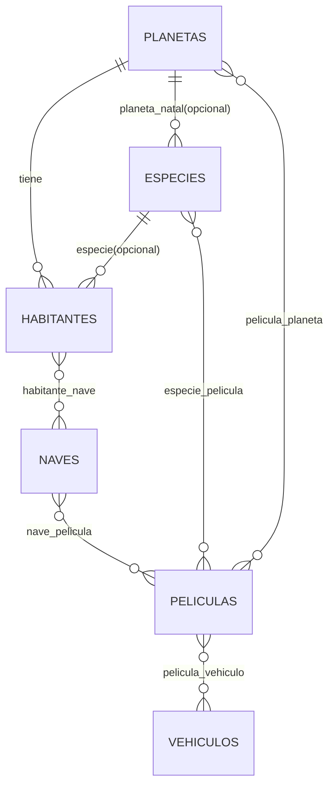

# subastop-tech-test-back

Backend REST (Laravel 11 / PHP 8.2) para el tech test.

Repo: `https://github.com/HarukaDev31/subastop-tech-test-back`

API REST construida con **Laravel 11 / PHP 8.2** que actúa como orquestador de la [Star Wars API (SWAPI)](https://swapi.py4e.com/documentation). Consume, transforma y almacena datos en español, con caché Redis, resiliencia en peticiones externas y gestión de datos locales.

---

## Tabla de contenidos

1. [Requisitos](#requisitos)
2. [Instalación local](#instalación-local)
3. [Instalación con Docker](#instalación-con-docker)
4. [Variables de entorno](#variables-de-entorno)
5. [Estructura del proyecto](#estructura-del-proyecto)
6. [Arquitectura y decisiones técnicas](#arquitectura-y-decisiones-técnicas)
7. [Base de datos (ERD + DBML)](#base-de-datos-erd--dbml)
8. [Seeds y datos de ejemplo](#seeds-y-datos-de-ejemplo)
9. [Endpoints](#endpoints)
10. [Ejecutar tests](#ejecutar-tests)

---

## Requisitos

| Herramienta | Versión mínima |
|-------------|---------------|
| PHP         | 8.2           |
| Composer    | 2.x           |
| MySQL       | 8.0           |
| Redis       | 7.x           |
| Docker      | 24.x (opcional) |

---

## Instalación local

```bash
# 1. Clonar el repositorio
git clone https://github.com/HarukaDev31/subastop-tech-test-back.git
cd subastop-tech-test-back

# 2. Instalar dependencias
composer install

# 3. Configurar entorno
cp .env.example .env
php artisan key:generate

# 4. Ajustar .env con tus credenciales de MySQL, Redis y API_KEY

# 5. Migrar base de datos
php artisan migrate

# 6. Iniciar servidor
php artisan serve
```

---

## Instalación con Docker

```bash
cp .env.example .env
# Editar .env si es necesario (APP_KEY se genera abajo)

docker compose up -d --build
docker compose exec app php artisan key:generate
docker compose exec app php artisan migrate
docker compose exec app php artisan db:seed
```

La API quedará disponible en `http://localhost:8000`.

---

## Variables de entorno

| Variable      | Descripción                                 | Ejemplo                  |
|---------------|---------------------------------------------|--------------------------|
| `API_KEY`     | Clave para proteger todos los endpoints     | `my-secret-key`          |
| `DB_*`        | Credenciales MySQL                          | ver `.env.example`       |
| `REDIS_HOST`  | Host de Redis                               | `127.0.0.1` / `redis`   |
| `CACHE_STORE` | Driver de caché (`redis` recomendado)       | `redis`                  |
| `REDIS_CLIENT`| Cliente Redis (`phpredis` recomendado)      | `phpredis`               |

---

## Estructura del proyecto

Carpetas principales (resumen):

```
app/
  Application/              # Casos de uso (UseCases) y orquestación
  Domain/                   # Contratos e invariantes del dominio (interfaces)
  Infrastructure/           # Implementaciones concretas (Eloquent repos, clients)
  Interfaces/Http/          # Adaptadores HTTP (controllers)
  Http/Requests/            # Validación (Form Requests)
  Http/Resources/           # Serialización de respuestas (JsonResource)
  Models/                   # Eloquent models
routes/
  api.php                   # Grupo con middleware api.key
  api_local.php             # CRUD local
  api_swapi.php             # Endpoints SWAPI (externa)
database/
  migrations/               # Esquema local
  seeders/                  # Seeds
docs/
  db/schema.dbml            # Esquema DBML para dbdiagram.io
```

## Arquitectura y decisiones técnicas

### Arquitectura (Hexagonal / DDD-lite)
El backend evoluciona hacia una arquitectura por capas:
- **Interfaces/Http**: controladores delgados (adaptadores).
- **Application**: casos de uso (UseCases) que orquestan.
- **Domain**: contratos (interfaces) y reglas del dominio.
- **Infrastructure**: implementaciones concretas (Eloquent, HTTP clients, cache).

Ejemplo real ya aplicado (vertical slice en Planetas):
- Controller: `app/Interfaces/Http/Local/PlanetaController.php`
- UseCases: `app/Application/Local/Planeta/UseCases/*`
- Repository interface: `app/Domain/Local/Planeta/PlanetaRepository.php`
- Eloquent repo: `app/Infrastructure/Persistence/Eloquent/PlanetaEloquentRepository.php`

### DTOs (Data Transfer Objects)
`PersonajeDTO`, `PlanetaSwapiDTO` y `NaveDTO` mapean atributos del inglés al español y garantizan tipado estricto antes de cualquier respuesta.

### Caché Redis
Todas las consultas GET a SWAPI se cachean **1 hora** en Redis para evitar peticiones redundantes a la API externa.

### Resiliencia
`Http::retry(3, 500ms)` con reintentos automáticos ante `ConnectionException` o errores 5xx. Timeout de 10 segundos.

### API Resources
Toda respuesta JSON pasa por un `JsonResource` (nunca un array crudo del modelo), garantizando consistencia de contrato.

### Seguridad
Middleware `ApiKeyMiddleware` protege **todas** las rutas; valida el header `X-API-KEY`.

### Base de datos
- Relación **Planeta → hasMany → Habitantes**
- Relación **Especie → hasMany → Habitantes** (opcional)
- Relación **Especie → belongsTo → Planeta (planeta natal)** (opcional)
- Relaciones many-to-many: películas con planetas/especies/vehículos; naves con películas; habitantes con naves (pilotos).
- Índices en columnas de búsqueda (`nombre`, `clima`, `terreno`, `genero`)
- `cascadeOnDelete` en la FK de habitantes

---

## Base de datos (ERD + DBML)

### ERD (Mermaid)



### DBML (completo)
- Archivo: `docs/db/schema.dbml`
- Importar en `https://dbdiagram.io` para ver el diagrama completo.

---

## Seeds y datos de ejemplo

Seeder principal:
- `database/seeders/DatabaseSeeder.php`

Ejecutar seeds:

```bash
php artisan db:seed
```

Con Docker:

```bash
docker compose exec app php artisan db:seed
```

Reset completo (útil en dev):

```bash
php artisan migrate:fresh --seed
```

## Endpoints

### Autenticación
Todos los endpoints requieren el header:
```
X-API-KEY: <tu-api-key>
```

---

### SWAPI (API externa con caché)

#### Personajes
| Método | URL                          | Descripción                      |
|--------|------------------------------|----------------------------------|
| GET    | `/api/swapi/personajes`      | Lista paginada (query: `pagina`) |
| GET    | `/api/swapi/personajes/{id}` | Detalle de un personaje          |

#### Planetas SWAPI
| Método | URL                         | Descripción           |
|--------|-----------------------------|-----------------------|
| GET    | `/api/swapi/planetas`       | Lista paginada        |
| GET    | `/api/swapi/planetas/{id}`  | Detalle de un planeta |

#### Naves estelares
| Método | URL                      | Descripción           |
|--------|--------------------------|-----------------------|
| GET    | `/api/swapi/naves`       | Lista paginada        |
| GET    | `/api/swapi/naves/{id}`  | Detalle de una nave   |

---

### Planetas locales (CRUD)

| Método | URL                   | Descripción                         |
|--------|-----------------------|-------------------------------------|
| GET    | `/api/planetas`       | Lista con filtros y paginación      |
| POST   | `/api/planetas`       | Crear planeta + habitantes          |
| GET    | `/api/planetas/{id}`  | Detalle con habitantes (eager load) |
| PUT    | `/api/planetas/{id}`  | Actualizar planeta                  |
| DELETE | `/api/planetas/{id}`  | Eliminar planeta                    |

**Query params GET `/api/planetas`:**
`nombre`, `clima`, `terreno`, `recientes` (días)

**Body POST `/api/planetas`:**
```json
{
  "nombre": "Tatooine",
  "clima": "árido",
  "terreno": "desierto",
  "diametro": 10465,
  "poblacion": 200000,
  "periodo_rotacion": 23,
  "periodo_orbital": 304,
  "gravedad": "1 standard",
  "agua_superficial": "1",
  "habitantes": [
    {
      "nombre": "Luke Skywalker",
      "altura": 172,
      "masa": 77,
      "color_cabello": "rubio",
      "color_piel": "claro",
      "color_ojos": "azul",
      "anio_nacimiento": "19BBY",
      "genero": "masculino"
    }
  ]
}
```

---

### Habitantes

| Método | URL                    | Descripción      |
|--------|------------------------|------------------|
| GET    | `/api/habitantes`      | Lista con filtros |
| POST   | `/api/habitantes`      | Crear habitante  |
| GET    | `/api/habitantes/{id}` | Detalle          |
| DELETE | `/api/habitantes/{id}` | Eliminar         |

**Query params:** `nombre`, `genero`

---

### Especies locales (CRUD)

| Método | URL                  | Descripción                    |
|--------|----------------------|--------------------------------|
| GET    | `/api/especies`      | Lista con filtros y paginación |
| POST   | `/api/especies`      | Crear especie                  |
| GET    | `/api/especies/{id}` | Detalle con relaciones         |
| PUT    | `/api/especies/{id}` | Actualizar especie             |
| DELETE | `/api/especies/{id}` | Eliminar especie               |

**Query params GET `/api/especies`:** `nombre`, `clasificacion`, `recientes` (días), `page`, `per_page`

---

### Naves locales (CRUD)

| Método | URL               | Descripción                    |
|--------|-------------------|--------------------------------|
| GET    | `/api/naves`      | Lista con filtros y paginación |
| POST   | `/api/naves`      | Crear nave                     |
| GET    | `/api/naves/{id}` | Detalle con relaciones         |
| PUT    | `/api/naves/{id}` | Actualizar nave                |
| DELETE | `/api/naves/{id}` | Eliminar nave                  |

**Query params GET `/api/naves`:** `nombre`, `clase`, `recientes` (días), `page`, `per_page`

---

### Películas locales (CRUD)

| Método | URL                   | Descripción                    |
|--------|-----------------------|--------------------------------|
| GET    | `/api/peliculas`      | Lista con filtros y paginación |
| POST   | `/api/peliculas`      | Crear película                 |
| GET    | `/api/peliculas/{id}` | Detalle con relaciones         |
| PUT    | `/api/peliculas/{id}` | Actualizar película            |
| DELETE | `/api/peliculas/{id}` | Eliminar película              |

**Query params GET `/api/peliculas`:** `titulo`, `director`, `recientes` (días), `page`, `per_page`

---

### Vehículos locales (CRUD)

| Método | URL                   | Descripción                    |
|--------|-----------------------|--------------------------------|
| GET    | `/api/vehiculos`      | Lista con filtros y paginación |
| POST   | `/api/vehiculos`      | Crear vehículo                 |
| GET    | `/api/vehiculos/{id}` | Detalle con relaciones         |
| PUT    | `/api/vehiculos/{id}` | Actualizar vehículo            |
| DELETE | `/api/vehiculos/{id}` | Eliminar vehículo              |

**Query params GET `/api/vehiculos`:** `nombre`, `clase`, `recientes` (días), `page`, `per_page`

---

### Select options (para autocompletes / selects)

Endpoints que devuelven todos los registros como `{ id, name }` / `{ id, title }` para poblar selects (respuesta cacheada):

| Método | URL                     | Descripción |
|--------|--------------------------|------------|
| GET    | `/api/select/planetas`   | Opciones de planetas |
| GET    | `/api/select/especies`   | Opciones de especies |
| GET    | `/api/select/habitantes` | Opciones de habitantes |
| GET    | `/api/select/peliculas`  | Opciones de películas |
| GET    | `/api/select/naves`      | Opciones de naves |
| GET    | `/api/select/vehiculos`  | Opciones de vehículos |

---

### Swagger / OpenAPI

- UI: `/api/documentation`
- JSON: `storage/api-docs/api-docs.json`

---

## Ejecutar tests

```bash
# Localmente
php artisan test

# Con reporte detallado
php artisan test --testdox

# Detener al primer fallo
php artisan test --stop-on-failure
```

> Los tests usan `Http::fake()` para simular SWAPI sin peticiones reales.

---

## CI/CD

GitHub Actions ejecuta automáticamente la suite de tests en cada push/PR a `main` o `develop`.

Ver configuración en [.github/workflows/ci.yml](.github/workflows/ci.yml).
